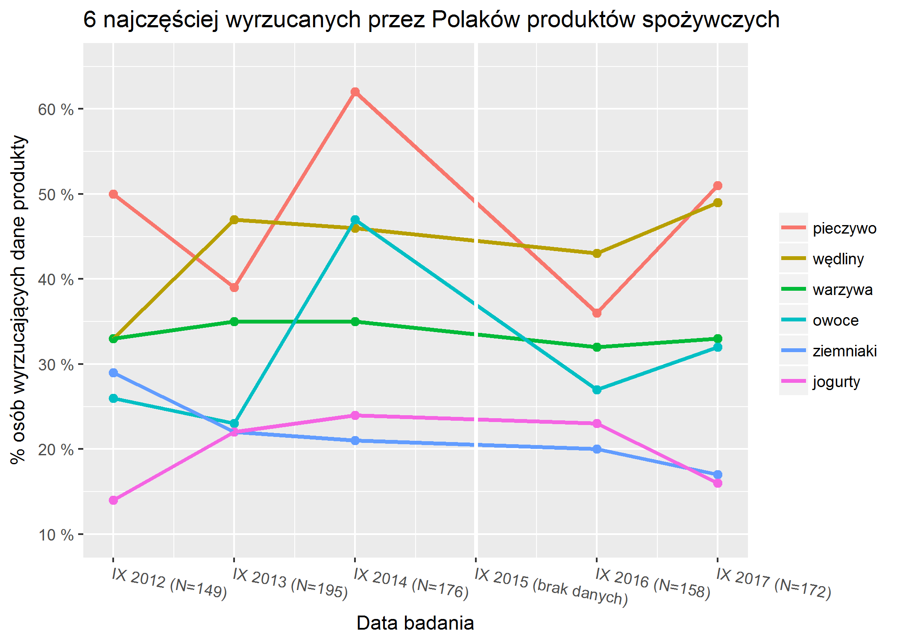

```{r setup, include=FALSE}
knitr::opts_chunk$set(echo = TRUE)
```

## Opis

W swojej pracy domowej postanowiłem poprawić [pracę domową nr 02 ](https://github.com/pbiecek/TechnikiWizualizacjiDanych2017/tree/master/PraceDomowe/PD_02/Kalinowska%20Maja%20PD2) autorstwa Mai Kalinowskiej. Dotyczyła ona [artykułu](https://businessinsider.com.pl/twoje-pieniadze/budzet-domowy/ile-polacy-wyrzucaja-jedzenia-raport-pazdziernik-2017/7285v6k) z portalu `businessinsider.com` opisującego wyniki badania `Kantar Millward Brown` na zlecenie `Federacji Polskich Banków Żywności`. Wykres, który Maja postanowiła poprawić, ukazywał grupy produktów najczęściej wskazywane jako te, które były wyrzucane przez respondentów. Prezentuje się on następująco:


```{r, out.width = "800px", echo = FALSE}
library(knitr)
knitr::include_graphics("wykres_oryg.png")
```

## Podejście Mai

Zmieniła ona całkowicie podejście do ukazania tej historii:

* uznała, że na wykresie jest za dużo linii i jest przez to nieczytelny
* przekształciła dane: ukazała odsetek odpowiedzi dla danej kategorii w poszczególnych latach
(1 wykres - 1 rok) dodając informację o procentowej zmianie względem zeszłego roku

```{r, out.width = "800px", echo = FALSE}
library(knitr)
knitr::include_graphics("wykres_maja.png")
```

## Podejście moje - wady wykresu

Uznałem, że można poprawić wykres oryginalny bez tak radykalnych kroków jak zmiana całej koncepcji wykresu (z liniowego na słupkowy rozbity na lata).
<br><br> Wady wykresu:

* Ukazuje on wszystkie 11 kategorii produktów, zamiast faktycznie 4-5 najczęściej wyrzucanych.
<br> To główna wada wykresu, ponieważ jest on umieszczony w sekcji artykułu pt. _Co najczęściej wyrzucają Polacy?_, w której autor wymienia jedynie 5 najczęściej wyrzucanych produktów. 
* Niepotrzebne są wartości procentowe nad każdym z punktów na wykresie - zaburzają one jego odbiór. Wystarczy `ggplot-owa` siatka, która ułatwi zorientowanie się w przebiegu linii na wykresie
* Oś `x` na wykresie: pojawiają się na niej kolejno lata: _2012, 2013, 2014, 2016, 2017_. W roku _2015_ nie było badania - takie rozmieszczenie punktów na osi `x` fałszuje odbiór trendu!
* Linie na wykresie są zaokrąglone - fałszuje to charakter danych (nie mamy do czynienia z danymi ciągłymi), szczególnie mocno w połączeniu z nierównomiernym rozmieszczeniem danych na osi `x`.

<br>Moja propozycja poprawy wykresu polega więc zasadniczo na usunięciu wad wykresu wejściowego, a nie całkowitej reorientacji sposobu pokazania historii:

## Podejście moje - wykres

Wykres oryginalny (dla przypomnienia)

```{r, out.width = "800px", echo = FALSE}
library(knitr)
knitr::include_graphics("wykres_oryg.png")
```

Wykres mój

```{r, out.width = "800px", echo = FALSE}
library(knitr)

```

Wykres jest czytelny, zawiera jedynie te produkty, które są istotne ze względu na opowiadana historię. Pokazuje pogrubioną białą linią fakt, że dla 2015 roku nie mamy danych.

## Kod 

```{r, eval = FALSE}
library(dplyr)
library(readxl)
library(ggplot2)

# zaladowanie i obrobka danych
dane = readxl::read_excel("jedzeniex.xlsx")

# interesujace nas kategorie
najczestsze = c("pieczywo", "wędliny", "warzywa", "owoce", "ziemniaki", "jogurty")

# braki w danych specjalnie umieszczone dla nowej daty gdzie nie bylo badania
dane <- filter(dane, dane$Rodzaj %in% najczestsze | is.na(dane$Rodzaj))

# przezwanie etykiety
dane$Czas_label <- ifelse(dane$Czas_label=='IX 2015', 'IX 2015 (brak danych)', dane$Czas_label)

# sztuczne nadanie brakom danych z roku 2015 odpowiednich wartosci i etykiet - spojnosc legend itd.
dane$Rodzaj <- ifelse(is.na(dane$Rodzaj), "pieczywo", dane$Rodzaj)
dane$Rodzaj <- factor(x = dane$Rodzaj, levels = najczestsze)
dane$Kod <- ifelse(is.na(dane$Wartosc), 1, 0)
dane$Wartosc <- ifelse(is.na(dane$Wartosc), 999, dane$Wartosc)


# kod do wyrysowania grafiki
p <- ggplot(dane, aes(x = Czas_group, y = Wartosc, na.rm = F, colour = Rodzaj)) +
  geom_point(show_guide = FALSE, size = 2) +
  geom_line(data = filter(dane, Kod==0), lwd = 1.05) +
  scale_y_continuous(limits = c(10, 65), breaks = seq(10, 60, 10), 
                     labels = paste0(seq(10, 60, 10), rep(" %", 6))) +
  scale_x_continuous(breaks = 1:6, labels = unique(dane$Czas_label)) +
  theme(legend.title = element_blank(),
        axis.text.x = element_text(angle = -10, hjust = 0)) +
  labs(x = "Data badania", y = "% osób wyrzucających dane produkty", 
       title = "6 najczęściej wyrzucanych przez Polaków produktów spożywczych") +
  geom_vline(xintercept = 4, col = "white", lwd = 1.1)

# zapis
ggsave("wykres_kamil.png", plot = p, device = "png")
```
