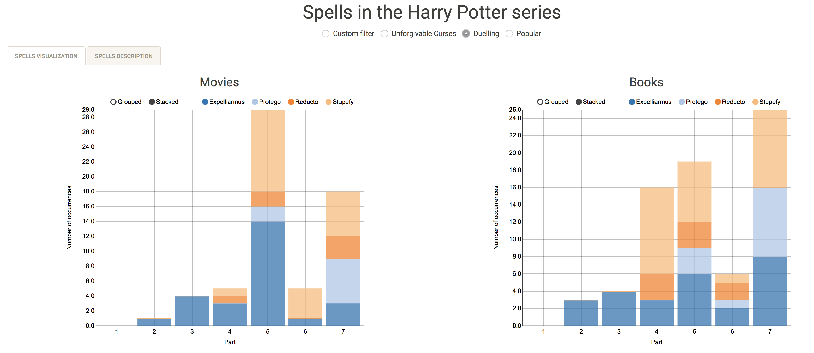
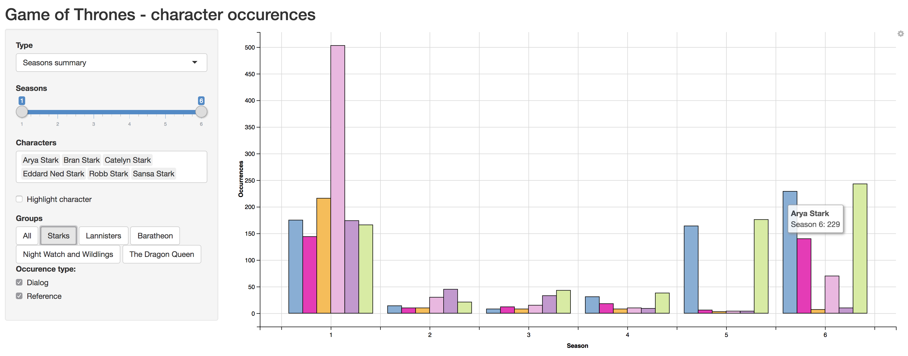
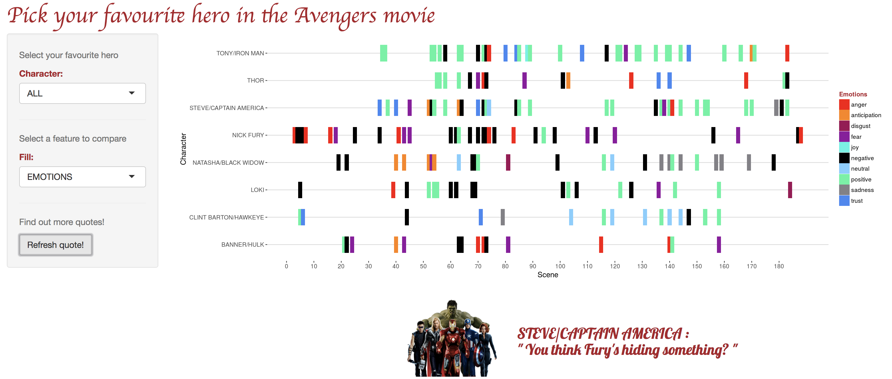
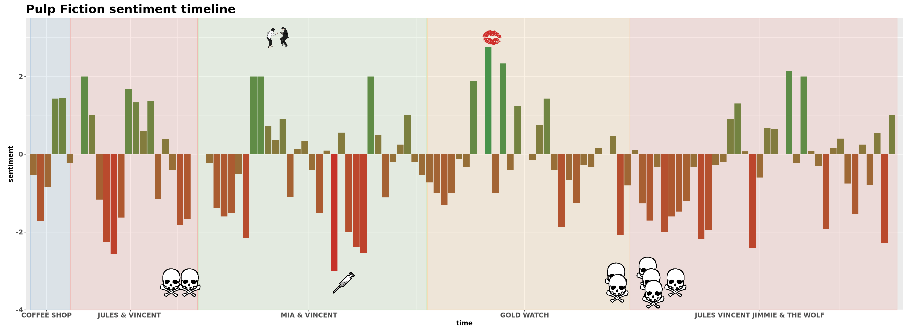
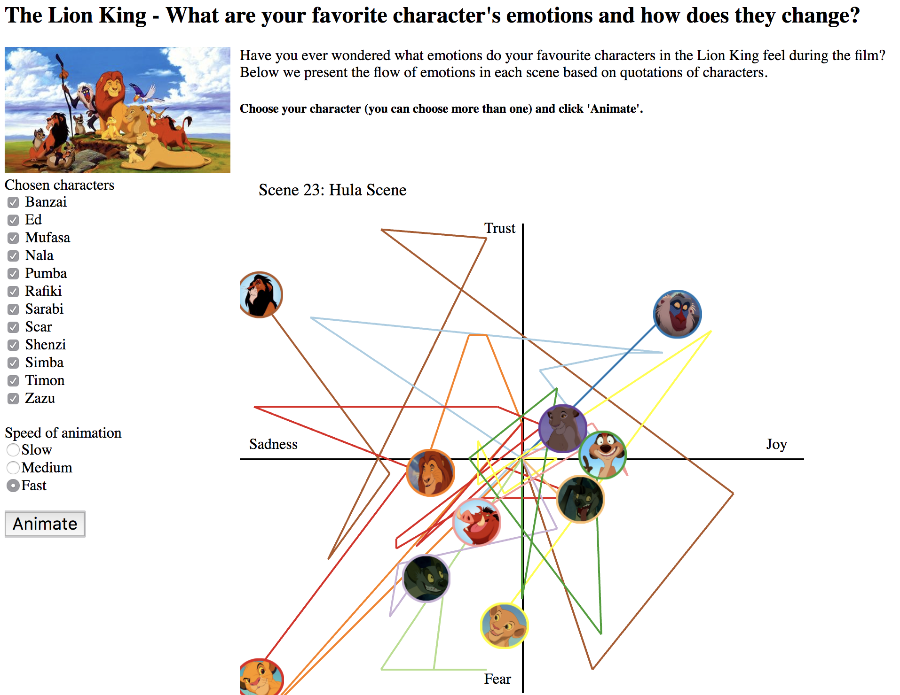
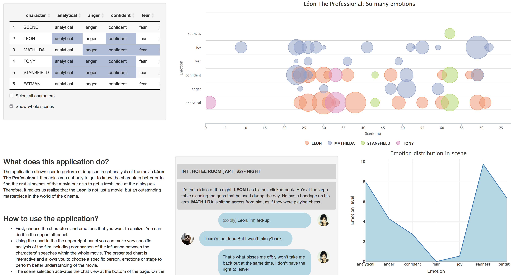

# Projekt 2

## Najlepsze projekty - top 6

### Harry Potter

https://prusinowskik.shinyapps.io/twd-projekt2/

### Games of Thrones

https://wd2017.shinyapps.io/game-of-thrones/

### Avengers

https://madziq.shinyapps.io/TWD_Projekt2/

### Pulp Fiction

http://ec2-18-195-240-248.eu-central-1.compute.amazonaws.com:3838/TWD/pulp-fiction/

### The Lion King

https://rawgit.com/pbiecek/TechnikiWizualizacjiDanych2017/master/Projekt_2/Gosiewska%20Marcinkowska/GosiewskaMarcinkowska_Projekt2.html

### Léon The Professional

https://franiis.shinyapps.io/shinyappbubbles/

## Opis

Celem drugiego projektu jest zbudowanie interaktywnej wizualizacji przedstawiającej wybrany film/serial.
Przedstawiać można interakcje pomiędzy postaciami w filmie, emocje w wypowiedziach, najczęstsze słowa - *the sky is the limit*.

Projekty można realizować w zespołach 2-3 osobowych. Ale nie można pracować z tą samą osobą co w projekcie 1.

Jako źródło danych najłatwiej będzie wykorzystać transkrypty lub scenariusze filmów.
Scenariusze bardzo wielu filmów znaleźć można w bazie IMSDB http://www.imsdb.com/
dla niektórych seriali trzeba poszukać głębiej, na przykład dla Gry o Tron adnotowane transkrypcje znajdują się tutaj
http://transcripts.foreverdreaming.org/viewtopic.php?t=7739
https://genius.com/Game-of-thrones-beyond-the-wall-script-annotated

Wynikiem projektu jest interaktywna wizualizacja wykonana w dowolnym narzędziu (D3, Tableau, rCharts, bez ograniczeń).
Każdy zespół przed prezentacją swojego rozwiązania umieszcza na GitHubie wizualizację i kody źródłowe (o ile ma to sens) w podkatalogu katalogu `Projekt_2`. 
Proszę NIE używać polskich liter w nazwach plików i katalogów.

W projekcie oceniane będą trzy aspekty, każde w skali 0-30 pkt, plus 0-10 pkt uwzględniających nieprzewidziane czynniki, które warto punktować:

* Opanowanie narzędzia. Jeżeli udało się wycisnąć wszystkie możliwość narzędzie to dobrze. Jeżeli ograniczono się tyko do podstawowych funkcji to źle.
* Innowacyjność / pomysłowość. Jeżeli przedstawiona jest ciekawa historia w czytelny sposób to dobrze.
* Interaktywność. Jeżeli wizualizacja pozwala na interakcje, która niesie dodatkową informacje to dobrze. Jeżeli interakcji nie ma lub nie niesie ona żadnej użytecznej informacji to źle.
